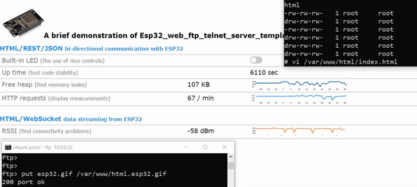
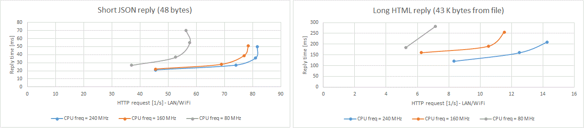
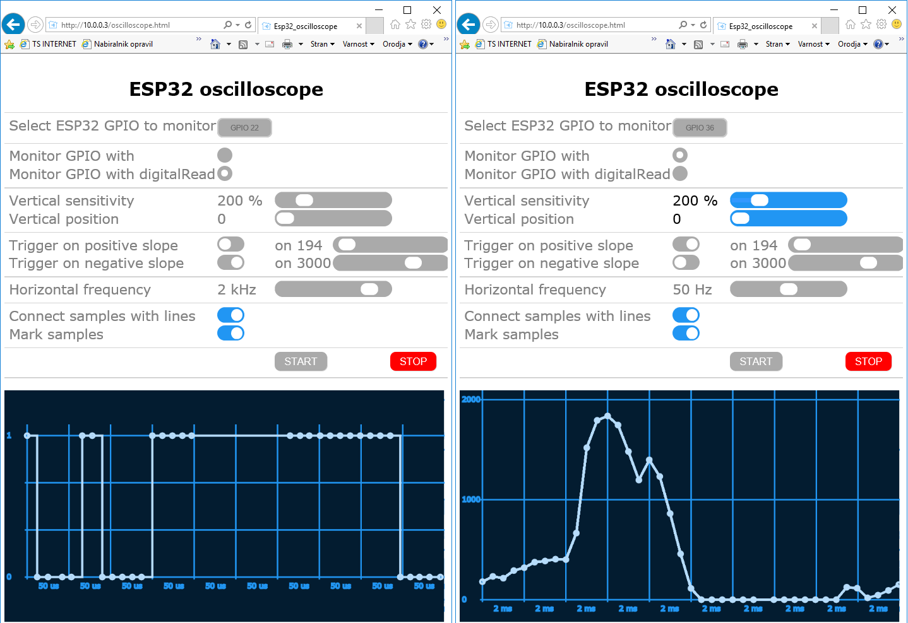

# ESP32 with HTTP server, Telnet server, file system, FTP server FTP client, SMTP client, cron daemon and user management.


## This template is a quick and easy way to build a nice user interface for an ESP32 project, without having to take care of all the switches, LED diodes, displays, etc.

   - You only have to modify the telnetCommandHandlerCallback function to build the Telnet user interface for your project.

   - You only have to modify the httpRequestHandler function to build the WEB user interface for your project. If you want a nice stylish look and feel there is also a FTP server built into the template so you can upload larger HTML files.

   - Dmesg message logging is built-in which can help you see what is going on at run-time and debug your project (accessible through Telnet server).

   - A Web-based Oscilloscope is already built-in which can help you see the signals on your Esp32 pins at run-time (accessible through Http server).

Demo ESP32 server is available at [http://jurca.dyn.ts.si](http://jurca.dyn.ts.si)


## The latest changes


The latest changes are support (this applies to built-in oscilloscope) for ESP32-S2, ESP32-S3 and ESP32-C3 boards (most of ESP32 boards should also just work).




## Fully multitasking HTTP server


HTTP server can handle HTTP requests in two different ways. As a programmed response to (for example REST) requests or by sending .html files from /var/www/html directory. Cookies and WebSockets are also supported to certain extent. Demo HTTP server is available at 193.77.159.208.

**HTTP server performance** 




## Fully multitasking Telnet server


Telnet server can, similarly to HTTP server, handle commands in two different ways. As a programmed response to some commands or it can execute already built-in commands (like ls, ping, ...). There is also a very basic text-editor built in, mainly for editing small configuration files. Demo Telnet server is available at 193.77.159.208 (login as root with default password rootpassword).


## Fully multitasking FTP server


FTP server is needed for uploading configuration files, .html files, ... to ESP32 file system. Both active and passive modes are supported.


## Time zones


All the time zones form https://github.com/nayarsystems/posix_tz_db/blob/master/zones.csv can be used.


## Simple key-value database


A simple key-value database is included for the purpose of managing (keeping) web session tokens. Other key-value databases can easily be added using the same technology, for different purposes (such as statistics of visited pages, etc). 


## Configuration files


```C++
/usr/share/zoneinfo                       - contains (POSIX) timezone information
/etc/passwd                               - contains users' accounts information
/etc/shadow                               - contains hashed users' passwords
/network/interfaces                       - contains WiFi STA(tion) configuration
/etc/wpa_supplicant/wpa_supplicant.conf   - contains WiFi STA(tion) credentials
/etc/dhcpcd.conf                          - contains WiFi A(ccess) P(oint) configuration
/etc/hostapd/hostapd.conf                 - contains WiFi A(ccess) P(oint) credentials
/etc/ntp.conf                             - contains NTP time servers names
/etc/crontab                              - contains scheduled tasks
/etc/mail/sendmail.cf                     - contains sendMail default settings
/etc/ftp/ftpclient.cf                     - contains ftpPut and ftpGet default settings
```


## Setup instructions


1. Copy all files in this package into Esp32_web_ftp_telnet_server_template directory.
2. Open Esp32_web_ftp_telnet_server_template.ino with Arduino IDE.
3. modify (some or all) the default #definitions in Esp32_servers_config.h file (that will be later written to configuration files) **before** the sketch is run for the first time:

```C++
// include version_of_servers.h to include version information
#include "./servers/version_of_servers.h"
// include dmesg_functions.h which is useful for run-time debugging - for dmesg telnet command
#include "./servers/dmesg_functions.h"


// 1. TIME:    #define which time settings, wil be used with time_functions.h - will be included later
    // define which 3 NTP servers will be called to get current GMT (time) from
    // this information will be written into /etc/ntp.conf file if file_system.h will be included
    #define DEFAULT_NTP_SERVER_1                      "1.si.pool.ntp.org"   // <- replace with your information
    #define DEFAULT_NTP_SERVER_2                      "2.si.pool.ntp.org"   // <- replace with your information
    #define DEFAULT_NTP_SERVER_3                      "3.si.pool.ntp.org"   // <- replace with your information
    // define time zone to calculate local time from GMT
    #define TZ                                        "CET-1CEST,M3.5.0,M10.5.0/3" // or select another (POSIX) time zones: https://github.com/nayarsystems/posix_tz_db/blob/master/zones.csv


// 2. FILE SYSTEM:     #define which file system you want to use 
    // the file system must correspond to Tools | Partition scheme setting: FAT for FAT partition scheme, LittleFS for SPIFFS partition scheme)
    #define FILE_SYSTEM    FILE_SYSTEM_LITTLEFS // or FILE_SYSTEM_FAT


// 3. NETWORK:     #define how ESP32 will use the network
    // STA(tion)
    // #define how ESP32 will connecto to WiFi router
    // this information will be written into /etc/wpa_supplicant/wpa_supplicant.conf file if file_system.h will be included
    // if these #definitions are missing STAtion will not be set up
    #define DEFAULT_STA_SSID                          "YOUR_STA_SSID"       // <- replace with your information
    #define DEFAULT_STA_PASSWORD                      "YOUR_STA_PASSWORD"   // <- replace with your information
    // the use of DHCP or static IP address wil be set in /network/interfaces if file_system.h will be included, the following is information needed for static IP configuration
    // if these #definitions are missing DHCP will be assumed
    // #define DEFAULT_STA_IP                            "10.18.1.200"      // <- replace with your information
    // #define DEFAULT_STA_SUBNET_MASK                   "255.255.255.0"    // <- replace with your information
    // #define DEFAULT_STA_GATEWAY                       "10.18.1.1"        // <- replace with your information
    // #define DEFAULT_STA_DNS_1                         "193.189.160.13"   // <- replace with your information
    // #define DEFAULT_STA_DNS_2                         "193.189.160.23"   // <- replace with your information

    // A(ccess) P(oint)
    // #define how ESP32 will set up its access point
    // this information will be writte into /etc/dhcpcd.conf and /etc/hostapd/hostapd.conf files if file_system.h will be included
    // if these #definitions are missing Access Point will not be set up
    // #define DEFAULT_AP_SSID                           HOSTNAME           // <- replace with your information,
    // #define DEFAULT_AP_PASSWORD                       "YOUR_AP_PASSWORD" // <- replace with your information, at least 8 characters
    // #define DEFAULT_AP_IP                             "192.168.0.1"      // <- replace with your information
    // #define DEFAULT_AP_SUBNET_MASK                    "255.255.255.0"    // <- replace with your information

    // define the name Esp32 will use as its host name 
    #define HOSTNAME                                   "MyEsp32Server"      // <- replace with your information,  max 32 bytes
    #define MACHINETYPE                                "ESP32 Dev Module"   // <- replace with your information, machine type, it is only used in uname telnet command


// 4. USERS:     #define what kind of user management you want before #including user_management.h
    #define USER_MANAGEMENT                           UNIX_LIKE_USER_MANAGEMENT // or HARDCODED_USER_MANAGEMENT or NO_USER_MANAGEMENT
    // if UNIX_LIKE_USER_MANAGEMENT is selected you must also include file_system.h to be able to use /etc/passwd and /etc/shadow files
    #define DEFAULT_ROOT_PASSWORD                     "rootpassword"        // <- replace with your information if UNIX_LIKE_USER_MANAGEMENT or HARDCODED_USER_MANAGEMENT are used
    #define DEFAULT_WEBADMIN_PASSWORD                 "webadminpassword"    // <- replace with your information if UNIX_LIKE_USER_MANAGEMENT is used
    #define DEFAULT_USER_PASSWORD                     "changeimmediatelly"  // <- replace with your information if UNIX_LIKE_USER_MANAGEMENT is used


// #include (or comment-out) the functionalities you want (or don't want) to use
#include "./servers/fileSystem.hpp"
#include "./servers/time_functions.h"               // file_system.h is needed prior to #including time_functions.h if you want to store the default parameters
#include "./servers/network.h"                      // file_system.h is needed prior to #including network.h if you want to store the default parameters
#include "./servers/httpClient.h"
#include "./servers/ftpClient.h"                    // file_system.h is needed prior to #including ftpClient.h if you want to store the default parameters
#include "./servers/smtpClient.h"                   // file_system.h is needed prior to #including smtpClient.h if you want to store the default parameters
#include "./servers/userManagement.hpp"             // file_system.h is needed prior to #including userManagement.hpp in case of UNIX_LIKE_USER_MANAGEMENT
#include "./servers/telnetServer.hpp"               // needs almost all the above files for whole functionality, but can also work without them
#include "./servers/ftpServer.hpp"                  // file_system.h is also necessary to use ftpServer.h
#include "./servers/httpServer.hpp"                 // file_system.h is needed prior to #including httpServer.h if you want server also to serve .html and other files
```

4. Select one of SPIFFS partition schemas (Tool | Partition Scheme).

5. Compile the sketch and run it on your ESP32. Doing this the following will happen:

   - ESP32 flash memory will be formatted with the LittleFs file system. FAT file system is supported as well. It is faster but uses (approximately 40 KB) more memory. WARNING: every information you have stored into ESP32's flash memory will be lost.
   - Configuration files will be created with the default settings.
   - Two users will be created: **root** with **rootpassword** and **webadmin** with **webadminpassword**.

At this point, you can already test if everything is going on as planned by http, FTP or telnet to your ESP32. Your ESP32 is already working as a server but there are a few minor things yet left to be done.

6. FTP (demo and example: index.html, ...) files from html directory to ESP32's /var/www/html/ directory.

7. Delete all the examples and functionalities that don't need and all the references to them in the code. They are included just to make the development easier for you.


## Debugging the code 


Telnet server provides Unix/Linux like dmesg circular message queue. You can monitor your ESP32 behaviour even when it is not connected to a computer with a USB cable. In your C++ code use dmesg () function to insert important messages about the state of your code into a circular queue. When you want to view it, connect to your ESP32 with Telnet client and type dmesg command.


## Debugging the signals


ESP32 oscilloscope is a web-based application included in Esp32_web_ftp_telnet_server_template. It is accessible through a web browser once oscilloscope.html is uploaded to ESP32's /var/www/html directory.


