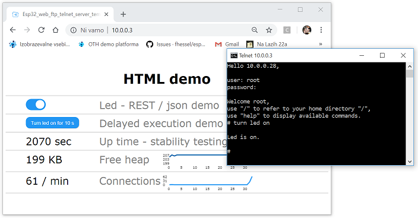

# ESP 32 with Web Server, Telnet Server, file system, FTP server and Real-time Clock

Esp32_web_ftp_telnet_server_templat makes developing Web and Telnet user interfaces for ESP32 projects almost as easy as possible. 

In case of Web user interface all you need to do is to upload (using FTP) .html (.png, .jpg, …) files into /var/www/html directory and/or modify httpRequestHandler function that already exists in Esp32_web_ftp_telnet_server_template.ino according to your needs (see examples below).

In case of Telnet all you need to do is to modify telnetCommandHandler function that already exists in Esp32_web_ftp_telnet_server_template.ino according to your needs (see example below).


You can go directly to Setup instructions and examples now or continue reading the rest of this text.

While working on my ESP32 / Arduino home automation project I was often missing functionalities that are available on bigger computers. This template is an attempt of providing some functionalities of operating system such as file system (SPIFFS is used), threaded Web, FTP and Telnet servers (all three are built upon threaded TCP server which is also included) to an ESP32 programmer. Rather then making a complete and finished software I decided to go with a working template that could easily be modified to each individual needs. The template demonstrates the use of Web interface to turn LED built into ESP32 on and off using REST calls and basically the same through the use of Telnet interface. It creates Unix like environment so Unix / Linux / Raspian programmers will be familiar with.

## Features

Here is a list of features of objects included into Esp32_web_ftp_telnet_server_template with their functionalities:

- **webServer** can handle HTTP requests in two different ways. As a programmed response to some requests (typically small replies – see examples) or by sending .html files that has been previously uploaded into /var/www/html directory. Features:

   - HTTP protocol,
   - WS protocol – only basic support for WebSockets is included so far,
   - webClient function is included for making simple HTTP requests,
   - threaded web server sessions,
   - time-out set to 1,5 seconds for HTTP protocol and 5 minutes for WS protocol to free up limited ESP32 resources used by inactive sessions,  
   - optional firewall for incoming requests.

- **telnetServer** can, similarly to webserver, handle commands in two different ways. As a programmed response to some commands or it can handle some already built-in commands by itself. Only a few built-in commands are implemented so far:

   - passwd,
   - ls ([directoryName]) or dir ([directoryName]),
   - cat [fileName] or type [fileName],
   - rm [fileName] or del [fileName],
   - ping [target] (ping used here was taken and modified from https://github.com/pbecchi/ESP32_ping),
   - ifconfig or ipconfig,
   - arp (synonym for "arp -a" as implemented here),
   - iw (synonym for "iw dev wlan1 station dump" as implemented here),
   - uptime,
   - reboot,
   - help,
   - quit.

Like webServer it also offers:

   - threaded Telnet sessions,
   - time-out set to 5 minutes to free up limited ESP32 resources used by inactive sessions,  
   - optional firewall for incoming connections.

- **ftpServer** is needed for uploading configuration files, .html files, etc onto ESP32 file system. Unlike webServer and telnetServer it does not expose a programming interface. Built-in commands that are implemented so far:

   - ls,
   - rm [esp32FileName],
   - put ([osFileName]) [esp32FileName],
   - get [sp32FileName] ([osFileName]).
Like webServer and telentServer it also offers:
   - threaded FTP sessions,
   - time-out set to 5 minutes to free up limited ESP32 the resources used by inactive sessions,  
   - optional firewall for incoming connections.

- **TcpServer** is the base for all three servers mentioned above but it can also be used as stand-alone (see example). Features:
   - threaded TCP server,
   - non-threaded TCP server,
   - non-threaded TCP client,
   - optional time-out to free up limited ESP32 resources used by inactive sessions,  
   - optional firewall for incoming connections.

- **File system** is needed for storing configuration files, .html files used by web server, etc. A SPIFFS flash file system is used in Esp32_web_ftp_telnet_server_template. Documentation on SPIFFS can be found at http://esp8266.github.io/Arduino/versions/2.0.0/doc/filesystem.html.

- **Network** configuration files. Esp32_web_ftp_telnet_server_template uses Unix / Linux / Raspbian like network configuration files (although it is a little awkward how network configuration is implemented in these operating systems). The following files are used to store STAtion and AccessPoint configuration parameters:

   - /network/interfaces
   - /etc/wpa_supplicant.conf
   - /etc/dhcpcd.conf
   - /etc/hostapd/hostapd.conf  

Modify these files according to your needs or upload your own files onto ESP32 by using FTP. 

- **User accounts**. Three types of managing user login are supported:

   - UNIX, LINUX, Raspbian like (using user management files),
   - hardcoded (username and password are hardcoded in to Arduino sketch constants),
   - no user management at all (everyone can Telnet or FTP to ESP32 servers).

By default Esp32_web_ftp_telnet_server_template uses UNIX, LINUX, Raspbian like user management files. Only "root" user with "rootpassword" password, "webadmin" user with "webadminpassword" password, "webserver" and "telnetserver" users are created at initialization. You can create additional users if you need them or change their passwords at initialization or upload your own files onto ESP32 by using FTP. User management implemented in Esp32_web_ftp_telnet_server_template is very basic, only 3 fields are used: user name, hashed password and home directory. The following files are used to store user management information:

      - /etc/passwd
      - /etc/shadow

- **Real time clock**. If you want to do something like turning the light on at certain time for example, ESP32 should be aware of current time. In Esp32_web_ftp_telnet_server_template real time clock reads current GMT time from NTP servers and synchronize internal clock once a day with them. You can define three NTP servers ESP32 will read GMT time from. Local time on the other hand is not covered adequately since different countries have different rules how to calculate it from GMT. Five European time zones are supported so far (change TIMEZONE definition in real_time_clock.hpp to select the one that is right for you:

   - GMT,   
   - WET (= GMT + DST), 
   - ISLAND (= GMT), 
   - CET (= GMT + 1 + DST), 
   - EET (= GMT + 2 + DST), 
   - FET (= GMT + 3). 

You may have to modify getLocalTime () function yourself to match your country and location.

## Setup instructions

1. Copy all files in this package into Esp32_web_ftp_telnet_server_template directory.
2. Open Esp32_web_ftp_telnet_server_template.ino with Arduino IDE.
3. Go to Network.h and do the following changes:

   - find and change YOUR-STA-SSID to your WiFi SSID,
   - find and change YOUR-STA-PASSWORD to your WiFi password,
   - find and change YOUR-AP-PASSWORD to the password your access point will be using.

4. Compile sketch and run it on your ESP32 for the first time.

Doing this the following will happen:

   - ESP32 flash memory will be formatted with SPIFFS file system. WARNING: every information you have stored into ESP32’s flash memory will be lost.
   - network configuration files will be created with the following settings:
      - your ESP32 will be configured to use DHCP in STAtion mode,
      - your ESP32 AccessPoint name will be ESP32_SRV,
      - your ESP32 AccessPoint IP will be 10.0.1.3,
   - user management files will be created with the following user accounts:
      - root / rootpassword,
      - webadmin / webadminpassword,
      - webserver with no password since this is a system account used only to define webserver home directory,
      - telnetserver with no password since this is also a system account used only to define telnetserver home directory.

At this point, you can already test if everything goes on as planned by www, FTP or Telnet to your ESP32. Your ESP32 is already working as a server but there are a few minor things yet left to do.

5. FTP to your ESP32 as webadmin / webadminpassword and upload the following files:

   - index.html,
   - android-192.png,
   - apple-180.png,
   - example02.html,
   - example03.html,
   - example04.html,
   - example09.html.

```
C:\esp32_web_ftp_telnet_server_template>ftp <your ESP32 IP here>
Connected to 10.0.0.3.
220-ESP32 FTP server - please login
User (10.0.0.3:(none)): webadmin
331 enter password
Password: webadminpassword
230 logged on, use "/" to refer to your home directory "/var/www/html/"
ftp> put index.html
226 /var/www/html/index.html transfer complete
ftp> put android-192.png
226 /var/www/html/android-192.png transfer complete
ftp> put apple-180.png
226 /var/www/html/apple-180.png transfer complete
ftp> put example02.html
226 /var/www/html/example02.html transfer complete
ftp> put example03.html
226 /var/www/html/example03.html transfer complete
ftp> put example04.html
226 /var/www/html/example04.html transfer complete
ftp> put example09.html
226 /var/www/html/example09.html transfer complete
ftp>
```

Files will be placed into webadmin home directory, which is configured to be /var/www/html/.

6. FTP to your ESP32 as root / rootpassword and upload help.txt into /var/telnet/ directory (put help.txt /var/telnet/help.txt), which is a home directory for telnetserver system account.

```
C:\esp32_web_ftp_telnet_server_template>ftp <your ESP32 IP here>
Connected to 10.0.0.3.
220-ESP32 FTP server - please login
User (10.0.0.3:(none)): root
331 enter password
Password: rootpassword
230 logged on, use "/" to refer to your home directory "/"
ftp> put help.txt /var/telnet/help.txt
226 /var/telnet/help.txt transfer complete
ftp>
```

## How to continue from here?

Esp32_web_ftp_telnet_server_template is what its name says, just a working template. A programmer is highly encouraged to add or change each piece of code as he or she sees appropriate for his or her projects. Esp32_web_ftp_telnet_server_template.ino is pretty comprehansive, small and easy to modify so it may be a good starting point.

## Building HTML user interface for your ESP32 project

A series of examples will demonstrate how to create a neatly HTML user interface for your ESP32 project.

**Example 01 - dynamic HTML page**

You can always use static HTML that can be uploaded (via FTP) as .html files into /var/www/html directory but they would always display the same content. If you want to show what is going on in your ESP32 you can generate a dynamic HTML page for each occasion. The easiest way is modifying httpRequestHandler function that already exists in Esp32_web_ftp_telnet_server_template.ino according to your needs. For example:

```C++
String httpRequestHandler (String httpRequest, WebSocket *webSocket) {
  if (httpRequest.substring (0, 20) == "GET /example01.html ") 
    return String ("<HTML>Example 01 - dynamic HTML page<br><br>") + (digitalRead (2) ? "Led is on." : "Led is off.") + String ("</HTML>");
                                                                   
  return ""; // httpRequestHandler did not handle httpRequest, let the web server try to process it otherway
}
```

**Example 02 - static HTML page calling REST functions**

Once HTML pages get large enough dynamic generation becomes impractical. The preferred way is building a large static HTML page that will be accessed by web browser and would call smaller server side functions. In this case, we have two sides where programming code is located at run time. The server side code is still in ESP32 whereas client side code is in your web browser. They communicate with each other in standardised way - through REST functions. Although REST functions could respond in HTML manner they usually use JSON format.

Let us look at server side first. Change code in httpRequestHandler function that already exists in Esp32_web_ftp_telnet_server_template.ino:

```C++
String httpRequestHandler (String httpRequest, WebSocket *webSocket) {  
  if (httpRequest.substring (0, 16) == "GET /builtInLed ") {
      return "{\"id\":\"esp32\",\"builtInLed\":\"" + (digitalRead (2) ? String ("on") : String ("off")) + "\"}\r\n";

  return "";  // httpRequestHandler did not handle httpRequest, let the web server try to process it otherway
}
```

We do not have C++ compiler available in a browser, but Javascript will do the job as well:

```HTML
<html>
  Example 02 - static HTML page calling REST functions<br><br>

  Led is <div id='ledState'>...</div>.

  <script type='text/javascript'>

    // mechanism that makes REST calls
    var httpClient = function () { 
      this.request = function (url, method, callback) {
        var httpRequest = new XMLHttpRequest ();
        httpRequest.onreadystatechange = function () {
          if (httpRequest.readyState == 4 && httpRequest.status == 200) callback (httpRequest.responseText);
        }
        httpRequest.open (method, url, true);
        httpRequest.send (null);
      }
    }

    // make a REST call and initialize/populate this page
    var client = new httpClient ();
    client.request ('/builtInLed', 'GET', function (json) {
                                                            // json reply is like: {"id":"ESP32_SRV","builtInLed":"on"}
                                                            document.getElementById ('ledState').innerText = (JSON.parse (json).builtInLed);
                                                          });

  </script>
</html>
```

**Example 03 - HTML page interacting with ESP32**

We had only one-way client – server (HTML - ESP32) communication so far. It was used to initialize/populate HTML page. However, the communication can also be bi-directional – client (HTML page) telling the server (ESP32) what to do. We will use the same mechanism with the exception of the use of PUT method instead of GET in REST calls. The latter is only the matter of understanding; GET method would do the job just as well.

Server will have to handle two additional cases:

```C++
String httpRequestHandler (String httpRequest, WebSocket *webSocket) {  
  if (httpRequest.substring (0, 16) == "GET /builtInLed ") {
getBuiltInLed:
      return "{\"id\":\"esp32\",\"builtInLed\":\"" + (digitalRead (2) ? String ("on") : String ("off")) + "\"}\r\n";
  } else if (httpRequest.substring (0, 19) == "PUT /builtInLed/on ") {
      digitalWrite (2, HIGH);
      goto getBuiltInLed;
  } else if (httpRequest.substring (0, 20) == "PUT /builtInLed/off ") {
      digitalWrite (2, LOW);
      goto getBuiltInLed;
  } 

  return "";  // httpRequestHandler did not handle httpRequest, let the web server try to process it otherway
}
```

In HTML we use input tag of checkbox type:

```HTML
<html>
  Example 03 - HTML page interacting with ESP32<br><br>

  Led: <input type='checkbox' disabled id='ledSwitch' onClick='turnLed (this.checked)'>

  <script type='text/javascript'>

    // mechanism that makes REST calls
    var httpClient = function () { 
      this.request = function (url, method, callback) {
        var httpRequest = new XMLHttpRequest ();
        httpRequest.onreadystatechange = function () {
          if (httpRequest.readyState == 4 && httpRequest.status == 200) callback (httpRequest.responseText);
        }
        httpRequest.open (method, url, true);
        httpRequest.send (null);
      }
    }

    // make a REST call and initialize/populate this page
    var client = new httpClient ();
    client.request ('/builtInLed', 'GET', function (json) {
                                                            // json reply will be in a form: {"id":"ESP32_SRV","builtInLed":"on"}
                                                            var obj=document.getElementById ('ledSwitch'); 
                                                            obj.disabled = false; 
                                                            obj.checked = (JSON.parse (json).builtInLed == 'on');
                                                          });

  function turnLed (switchIsOn) { // send desired led state to ESP32 and refresh ledSwitch state
    client.request (switchIsOn ? '/builtInLed/on' : '/builtInLed/off' , 'PUT', function (json) {
                                                            var obj = document.getElementById ('ledSwitch'); 
                                                            obj.checked = (JSON.parse (json).builtInLed == 'on');                                                           
                                                          });
  }

  </script>
</html>
```

Everything works fine now but it looks awful.

**Example 04 - user interface with style**
   
Style user interface with CSS:

```HTML
<html>

  <style>
    .switch{position:relative;display:inline-block;width:60px;height:34px}
    .slider{position:absolute;cursor:pointer;top:0;left:0;right:0;bottom:0;background-color:#ccc;-webkit-transition:.4s;transition:.4s}
    .slider:before{position:absolute;content:'';height:26px;width:26px;left:4px;bottom:4px;background-color:white;-webkit-transition:.4s;transition:.4s}
    input:checked+.slider{background-color:#2196F3}
    input:focus+.slider{box-shadow: 0 0 1px #2196F3}
    input:checked+.slider:before{-webkit-transform:translateX(26px);-ms-transform:translateX(26px);transform:translateX(26px);}
    .switch input{display:none}
    .slider.round{border-radius:34px}
    .slider.round:before{border-radius:50%}
    input:disabled+.slider{background-color:gray}
  </style>

  <body>

    Example 04 - user interface with style<br><br>

    Led: <label class='switch'><input type='checkbox' disabled id='ledSwitch' onClick='turnLed(this.checked)'><div class='slider round'></div></label>

    <script type='text/javascript'>

      // mechanism that makes REST calls
      var httpClient = function () { 
        this.request = function (url, method, callback) {
          var httpRequest = new XMLHttpRequest ();
          httpRequest.onreadystatechange = function () {
            if (httpRequest.readyState == 4 && httpRequest.status == 200) callback (httpRequest.responseText);
          }
          httpRequest.open (method, url, true);
          httpRequest.send (null);
        }
      }

      // make a REST call and initialize/populate this page
      var client = new httpClient ();
      client.request ('/builtInLed', 'GET', function (json) {
                                                              // json reply will be in a form: {"id":"ESP32_SRV","builtInLed":"on"}
                                                              var obj = document.getElementById ('ledSwitch'); 
                                                              obj.disabled = false; 
                                                              obj.checked = (JSON.parse (json).builtInLed == 'on');
                                                            });

    function turnLed (switchIsOn) { // send desired led state to ESP and refresh ledSwitch state
      client.request (switchIsOn ? '/builtInLed/on' : '/builtInLed/off' , 'PUT', function (json) {
                                                              var obj = document.getElementById ('ledSwitch'); 
                                                              obj.checked = (JSON.parse (json).builtInLed == 'on');                                                           
                                                            });
    }

    </script>
  </body>
</html>
```

## Building Telnet user interface for your ESP32 project

**Example 05 - processing Telnet command line**

Compared to HTML user interface Telnet user interface is a piece of cake. Modify telnetCommandHandler function that already exists in Esp32_web_ftp_telnet_server_template.ino according to your needs. For example:

```C++
String telnetCommandHandler (String command, String parameter, String homeDirectory) {
  if (command + " " + parameter  == "led state") {
getBuiltInLed:
    return "Led is " + (digitalRead (2) ? String ("on.\n") : String ("off.\n"));
  } else if (command + " " + parameter == "turn led on") {
    digitalWrite (2, HIGH);
    goto getBuiltInLed;
  } else if (command + " " + parameter  == "turn led off") {
    digitalWrite (2, LOW);
    goto getBuiltInLed;
  }
  
  return ""; // telnetCommandHandler did not handle command | parameter, let the telnet server try to process it otherway
}
```

## Examples

**Example 06 - SPIFFS file system and delays**

Example shows how to access files on SPIFFS and/or perform delays properly in a multi-threaded environment. Why are those two connected? The issue is well described in https://www.esp32.com/viewtopic.php?t=7876: "vTaskDelay() cannot be called whilst the scheduler is disabled (i.e. in between calls of vTaskSuspendAll() and vTaskResumeAll()). The assertion failure you see is vTaskDelay() checking if it was called whilst the scheduler is disabled." Some SPIFFS functions internally call vTaskSuspendAll() hence no other thread should call delay()  (which internally calls vTaskDelay()) since we cannot predict if this would happen while the scheduler is disabled.

Esp32_web_ftp_telnet_server_template introduces a SPIFFSsemaphore mutex that prevents going into delay() and SPIFSS functions simultaneously from different threads. Calling a delay() function is not thread safe (when used together with SPIFFS) and would crash ESP32 occasionally. Use SPIFFSsafeDelay() instead.

```C++
for (int i = 0; i < 3; i++) {
  String s = "";
  File file;

  xSemaphoreTake (SPIFFSsemaphore, portMAX_DELAY); // always take SPIFFSsemaphore before any SPIFSS operations
  
  if ((bool) (file = SPIFFS.open ("/ID", FILE_READ)) && !file.isDirectory ()) {
    while (file.available ()) s += String ((char) file.read ());
    file.close (); 
    Serial.printf ("[example 06] %s\n", s.c_str ());
  } else {
    Serial.printf ("[example 06] can't read file /ID\n");
  }
  
  xSemaphoreGive (SPIFFSsemaphore); // always give SPIFFSsemaphore when SPIFSS operation completes
  
  SPIFFSsafeDelay (1000); // always use SPIFFSsafeDelay() instead of delay()
}
```

**Example 07 - reading time**

Example 07 demonstrates the use of rtc (real time clock) instance built into Esp32_web_ftp_telnet_server_template.

```C++
if (rtc.isGmtTimeSet ()) {
  time_t now;
  now = rtc.getGmtTime ();
  Serial.printf ("[example 07] current UNIX time is %lu\n", (unsigned long) now);

  char str [30];
  now = rtc.getLocalTime ();
  strftime (str, 30, "%d.%m.%y %H:%M:%S", gmtime (&now));
  Serial.printf ("[example 07] current local time is %s\n", str);
} else {
  Serial.printf ("[example 07] rtc has not obtained time from NTP server yet\n");
}
```

**Example 08 - making HTTP requests (REST calls for example) directly from ESP32**

Up to now, we have only made REST calls from within Javascript (from browser). However, for establishing machine-to-machine communication REST calls should be made directly from C++ code residing in ESP32.  The only drawback is that C++ does not support parsing JSON answers natively. You have to program the parsing yourself (not included in this example).

Example 08 shows how we can use TcpServer objects to make HTTP requests.

```C++
void example08_makeRestCall () {
  String s = webClient ("127.0.0.1", 80, 5000, "GET /upTime"); // send request to local loopback port 80, wait max 5 s (time-out)
  if (s > "")
    Serial.print ("[example 08] " + s);
  else
    Serial.printf ("[example 08] the reply didn't arrive (in time) or it is corrupt or too long\n");

  return;
}
```

## WebSockets

**Example 09 - WebSockets**

A basic WebSocket support is built-in into webServer. Text and binary data can be exchanged between browser and ESP32 server in both ways. Although I have tested the example below on different platforms such as Windows / Intel, iPhone, Android / Samsung they all use the same byte ordering as ESP32 – little endian so they understand each other without doing byte reordering. TCP suggests using network byte ordering for sending binary data over network which is big endian. Since Javascript does not follow this rule neither can ESP32. To be able to communicate with big endian machines there are two possibilities. The first one is to stay with data exchange in text format, the second is to do byte reordering for both, incoming and outgoing packets of binary data (using hton, ntoh C functions) on ESP32 server side.

Example 09 demonstrates how ESP32 server could handle WebSockets:

```C++
String httpRequestHandler (String httpRequest, WebSocket *webSocket) {  // - normally httpRequest is HTTP request, webSocket is NULL, function returns a reply in HTML, json, ... formats or "" if request is unhandeled
                                                                        // - for WebSocket httpRequest is WS request, webSocket pointer is set, whatever function returns will be discarded
                                                                        // - has to be reentrant!

  if (httpRequest.substring (0, 26) == "GET /example09_WebSockets " && webSocket) { // Example 09

    while (true) {
      switch (webSocket->available ()) {
        case WebSocket::NOT_AVAILABLE:  SPIFFSsafeDelay (1);
                                        break;
        case WebSocket::STRING:       { // text received
                                        String s = webSocket->readString ();
                                        Serial.printf ("[example 09] got text from browser over webSocket: %s\n", s.c_str ());
                                        break;
                                      }
        case WebSocket::BINARY:       { // binary data received
                                        char buffer [256];
                                        int bytesRead = webSocket->readBinary (buffer, sizeof (buffer));
                                        Serial.printf ("[example 09] got %i bytes of binary data from browser over webSocket\n"
                                                       "[example 09]", bytesRead);
                                        // note that we don't really know anything about format of binary data we have got, we'll just assume here it is array of 16 bit integers
                                        // (I know they are 16 bit integers because I have written javascript client example myself but this information can not be obtained from webSocket)
                                        int16_t *i = (int16_t *) buffer;
                                        while ((char *) (i + 1) <= buffer + bytesRead) Serial.printf (" %i", *i ++);
                                        Serial.printf ("\n[example 09] Looks like this is the Fibonacci sequence,\n"
                                                         "[example 09] which means that both, endianness and complements are compatible with javascript client.\n");
                                        
                                        // send text data
                                        if (!webSocket->sendString ("Thank you webSocket client, I'm sending back 8 32 bit binary floats.")) goto errorInCommunication;
  
                                        // send binary data
                                        float geometricSequence [8] = {1.0}; for (int i = 1; i < 8; i++) geometricSequence [i] = geometricSequence [i - 1] / 2;
                                        if (!webSocket->sendBinary ((byte *) geometricSequence, sizeof (geometricSequence))) goto errorInCommunication;
                                                         
                                        break; // this is where webSocket connection ends - in our simple "protocol" browser closes the connection but it could be the server as well ...
                                               // ... just "return;" in this case (instead of break;)
                                      }
        case WebSocket::ERROR:          
  errorInCommunication:     
                                        Serial.printf ("[example 09] error in communication, closing connection\n");
                                        return ""; // close this connection, the return value will be discarded (in WebSocket case) so it doesn't matter wht it is
      }
    }
                                                                    
  else return ""; // HTTP request has not been handled by httpRequestHandler - let the webServer handle it itself
}
```

On the browser site Javascript program could look something like this:

```HTML
<html>
  <body>

    Example 09 - using WebSockets<br><br>

    <script type='text/javascript'>

      if ("WebSocket" in window) {
        var ws = new WebSocket ("ws://10.0.0.3/example09_WebSockets"); // open webSocket connection
				
        ws.onopen = function () {
          alert ("WebSocket connection established.");

          // ----- send text data -----

          ws.send ("Hello webSocket server, after this text I'm sending 32 16 bit binary integers."); 
          // alert ("Text sent over WebSocket.");

          // ----- send binary data -----

          const fibonacciSequence = new Uint16Array (32);
          fibonacciSequence [0] = -21;
          fibonacciSequence [1] = 13;
          for (var i = 2; i < 32; i ++) fibonacciSequence [i] = fibonacciSequence [i - 1] + fibonacciSequence [i - 2]; 
          ws.send (fibonacciSequence);
          // alert ("Binary data sent over WebSocket.");
        };

        ws.onmessage = function (evt) { 
          if (typeof(evt.data) === 'string' || evt.data instanceof String) { // // UTF-8 formatted string data

            // ----- receive text data -----

            alert ("[example 09] got text from server over webSocket: " + evt.data);
	  }
          if (evt.data instanceof Blob) { // binary data

            // ----- receive binary data as blob and then convert it into array buffer -----

            var myFloat32Array = null;
            var myArrayBuffer = null;
            var myFileReader = new FileReader ();
            myFileReader.onload = function (event) {
              myArrayBuffer = event.target.result;
              myFloat32Array = new Float32Array (myArrayBuffer); // <= our data is now here, in the array of 32 bit floating point numbers

              var myMessage = "[example 09] got " + myArrayBuffer.byteLength + " bytes of binary data from server over webSocket\n[example 09]";
              for (var i = 0; i < myFloat32Array.length; i++) myMessage += " " + myFloat32Array [i];
                alert (myMessage);
                // note that we don't really know anything about format of binary data we have got, we'll just assume here it is array of 32 bit floating point numbers
                // (I know they are 32 bit floating point numbers because I have written server C++ example myself but this information can not be obtained from webSocket)

                alert ("[example 09] Looks like this is the geometric sequence,\n" + 
                       "[example 09] which means that 32 bit floating point format is compatible with ESP32 C++ server.\n");

                ws.close (); // this is where webSocket connection ends - in our simple "protocol" browser closes the connection but it could be the server as well

            };
            myFileReader.readAsArrayBuffer (evt.data);

          }
        };
				
        ws.onclose = function () { 
          alert ("WebSocket connection is closed."); 
        };

      } else {
        alert ("WebSockets are not supported by your browser.");
      }

    </script>
  </body>
</html>
```

## Writing your own server using TCP protocol

**Example 10 - Morse server**

In example 10 we’ll create a Morse echo server with the use of TcpServer instance. Whenever two computers communicate with each other, they have to follow a protocol of communication. Morse echo server protocol is very simple. The server will read everything the client sends, convert it into Morse code and send reply back to the client.
Morse echo server will only listen on port 24 for 30 seconds then it will shut down and free the resources.
While starting and stopping the server is quite straightforward, more attention has to be put to routine that handles the connection. Make sure it is re-entrant for it can run in many threads simultaneously.

```C++
// start new TCP server
TcpServer *myServer = new TcpServer (morseEchoServerConnectionHandler, // function that is going to handle the connections
                                     NULL,      // no additional parameter will be passed to morseEchoServerConnectionHandler function
                                     4096,      // 4 KB stack for morseEchoServerConnectionHandler is usually enough
                                     180000,    // time-out - close connection if it is inactive for more than 3 minutes
                                     "0.0.0.0", // serverIP, 0.0.0.0 means that the server will accept connections on all available IP addresses
                                     24,        // server port number, 
                                     NULL);     // don't use firewall in this example
// check success
if (myServer->started ()) {
  Serial.printf ("[example 10] Morse echo server started, try \"telnet <server IP> 24\" to try it\n");

  // let the server run for 30 seconds - this much time you have to connect to it to test how it works
  SPIFFSsafeDelay (30000);

  // shut down the server - is any connection is still active it will continue to run anyway
  delete (myServer);
  Serial.printf ("[example 10] Morse echo server stopped, already active connections will continue to run anyway\n");
} else {
  Serial.printf ("[example 10] unable to start Morse echo server\n");
}

void morseEchoServerConnectionHandler (TcpConnection *connection, void *parameterNotUsed) {  // connection handler callback function
  Serial.printf ("[example 10] new connection arrived from %s\n", connection->getOtherSideIP ());
  
  char inputBuffer [256] = {0}; // reserve some stack memory for incomming packets
  char outputBuffer [256] = {0}; // reserve some stack memory for output buffer 
  int bytesToSend;
  // construct Morse table. Make it static so it won't use the stack
  static char *morse [43] = {"----- ", ".---- ", "..--- ", "...-- ", "....- ", // 0, 1, 2, 3, 4
                             "..... ", "-.... ", "--... ", "---.. ", "----. ", // 5, 6, 7, 8, 9
                             "   ", "", "", "", "", "", "",                    // space and some characters not in Morse table
                             ".- ", "-... ", "-.-. ", "-.. ", ". ",            // A, B, C, D, E
                             "..-. ", "--. ", ".... ", ".. ", ".--- ",         // F, G, H, I, J
                             "-.- ", ".-.. ", "-- ", "-. ", "--- ",            // K, L, M, N, O
                             ".--. ", "--.- ", ".-. ", "... ", "- ",           // P, Q, R, S, T
                             "..- ", "...- ", ".-- ", "-..- ", "-.-- ",        // U, V, W, X, Y
                             "--.. "};                                         // Z
  char finiteState = ' '; // finite state machine to detect quit, valid states are ' ', 'q', 'u', 'i', 't'
  unsigned char c;
  int index;  
  
  // send welcome reply first as soon as new connection arrives - in a readable form
  #define IAC 255
  #define DONT 254
  #define ECHO 1
  sprintf (outputBuffer, "Type anything except quit. Quit will end the connection.%c%c%c\r\n", IAC, DONT, ECHO); 
  // IAC DONT ECHO is not really necessary. It is a part of telnet protocol. Since we'll be using a telnet client
  // to test this example it is a good idea to communicate with it in the way it understands
  bytesToSend = strlen (outputBuffer);
  if (connection->sendData (outputBuffer, bytesToSend) != bytesToSend) {
    *outputBuffer = 0; // mark outputBuffer as empty
    Serial.printf ("[example 10] error while sending response\n");
    goto endThisConnection;
  }
  *outputBuffer = 0; // mark outputBuffer as empty
  
  // Read and process input stream in endless loop, detect "quit" substring. 
  // If "quit" substring is present then end this connection.
  // If 0 bytes arrive then the client has ended the connection or there are problems in communication.
  while (int received = connection->recvData (inputBuffer, sizeof (inputBuffer))) {
    for (int i = 0; i < received; i ++) {
      // calculate index of morse table entry
      c = inputBuffer [i];

      index = 11;                                     // no character in morse table
      if (c == ' ') index = 10;                       // space in morse table
      else if (c >= '0' && c <= 'Z') index = c - '0'; // letter in morse table
      else if (c >= 'a' && c <= 'z') index = c - 80;  // letter converted to upper case in morse table

      // fill outputBuffer if there is still some space left otherwise empty it
      if (strlen (outputBuffer) + 7 > sizeof (outputBuffer)) {
        bytesToSend = strlen (outputBuffer);
        if (connection->sendData (outputBuffer, bytesToSend) != bytesToSend) {
          *outputBuffer = 0; // mark outputBuffer as empty
          Serial.printf ("[example 10] error while sending response\n");
          goto endThisConnection;
        }
        strcpy (outputBuffer, morse [index]); // start filling outputBuffer with morse letter
      } else {
        strcat (outputBuffer, morse [index]); // append morse letter to outputBuffer
      }

      // calculat finite machine state to detect if "quit" has been entered
      switch (c /* inputBuffer [i] */) {
        case 'Q':
        case 'q': finiteState = 'q';
                  break;
        case 'U':
        case 'u': if (finiteState == 'q') finiteState = 'u'; else finiteState = ' ';
                  break;
        case 'I':
        case 'i': if (finiteState == 'u') finiteState = 'i'; else finiteState = ' ';
                  break;
        case 'T':
        case 't': if (finiteState == 'i') goto endThisConnection; // quit has been entered
                  else finiteState = ' ';
                  break; 
        default:  finiteState = ' ';
                  break;
      }
    } // for loop
    bytesToSend = strlen (outputBuffer);
    if (connection->sendData (outputBuffer, bytesToSend) != bytesToSend) {
      *outputBuffer = 0; // mark outputBuffer as empty
      Serial.printf ("[example 10] error while sending response\n");
      goto endThisConnection;
    }    
    *outputBuffer = 0; // mark outputBuffer as empty
  } // while loop

endThisConnection: // first check if there is still some data in outputBuffer and then just let the function return 
  if (*outputBuffer) {
    bytesToSend = strlen (outputBuffer);
    if (connection->sendData (outputBuffer, bytesToSend) != bytesToSend) 
      Serial.printf ("[example 10] error while sending response\n");
  }
  Serial.printf ("[example 10] connection has just ended\n");
}
```
