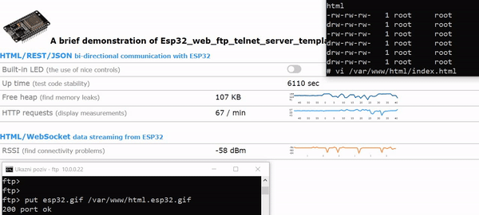
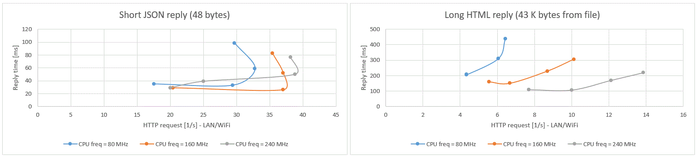
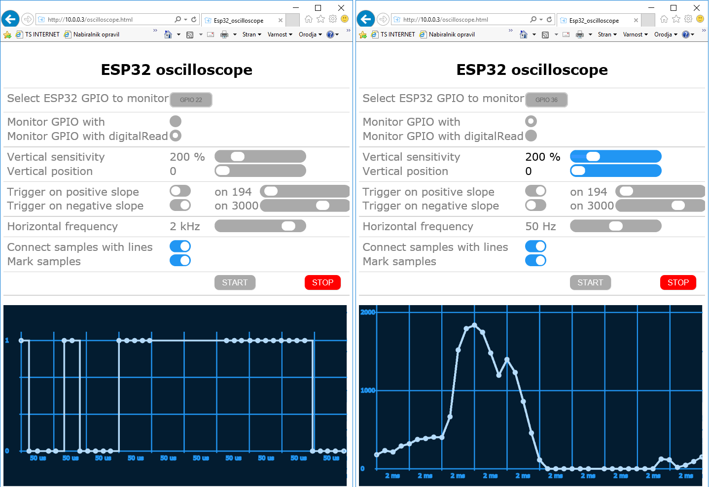

# ESP32 server

This template provides a fully multitasking IPv4 (and IPv6‑ready) ESP32 server with built‑in HTTP, Telnet, and FTP services. It includes a suite of essential tools for managing, monitoring, and programming your IoT device, such as ping, ifconfig, crontab, dmesg, a web‑based oscilloscope, and more.

Designed as a flexible starting point, the template can be easily customized to fit your project. Any unused features can be removed to reduce memory usage and improve performance.

With this template, you can quickly build a clean web interface or a Telnet‑based command‑line interface for your prototype—without relying on physical buttons, LEDs, or displays.


 - To create a custom Telnet interface, extend the telnetCommandHandlerCallback() function.

 - To build a web interface, modify the httpRequestHandler() function. For more advanced UI designs, the integrated FTP server allows you to upload larger HTML files directly.

 - You can also monitor runtime debug messages—even when the ESP32 is not connected to USB—using the dmesg command over Telnet.

Demo ESP32 server is available at [http://jurca.dyn.ts.si](http://jurca.dyn.ts.si)


## Prerequisites


This template depends on the following Arduino libraries (all available on GitHub):

    - ESP32_Multitasking_Network_Suite: https://github.com/BojanJurca/Multitasking-Http-Ftp-Telnet-Ntp-Smtp-Servers-and-clients-for-ESP32-Arduino-Library
    - ThreadSafePing: https://github.com/BojanJurca/Thread-safe-ping-Arduino-library-for-ESP32
    - ThreadSafeFS: https://github.com/BojanJurca/Thread-safe-file-sytem-wrapper-Arduino-library-for-ESP32
    - LightweightSTL: https://github.com/BojanJurca/Lightweight-Standard-Template-Library-STL-for-Arduino
    - cronDaemon: https://github.com/BojanJurca/Cron-Daemon-for-Arduino


## The latest changes


**April 27, 2026**:

 - All major components have been moved into separate Arduino libraries (listed above).

 - Thread‑safe wrappers added around the file system and LwIP.

 - This repository now serves as a complete working server template combining all libraries.


**May 22, 2025**: 

 - Support for .html.gz (compressed) files.

 - OTA update support.

 - Stability improvements for smaller ESP32 models (e.g., ESP32‑S2).

 - Optional mode to run listeners and the cron daemon inside the main setup()/loop() task to save memory.


**February 6, 2025**: 

 - Dual‑stack networking (IPv4 + IPv6).

 - Support for Linux Telnet and FTP clients.

 - Added mDNS service (access the server by hostname on the local network).

 - Memory usage optimizations.

 - Power‑saving modes.

 - Locale support (locale files themselves must be provided by the user).

 - Removal of several rarely used features.





## Fully multitasking HTTP server


HTTP server can handle HTTP requests in two different ways. As a programmed response to (for example REST) requests or by sending .html files from /var/www/html directory. Cookies and WebSockets are also supported to certain extent. Since HTTP server is fully multitasking, multiple WebSockets are really easy to implement.


**HTTP server performance** 





## Fully multitasking Telnet server


Telnet server can, similarly to HTTP server, handle commands in two different ways. As a programmed response to some commands or it can execute already built-in commands (like ls, ping, ...). There is also a basic text-editor built in, mainly for editing small configuration files.


## Fully multitasking FTP server


FTP server is needed for uploading configuration files, .html files, ... to ESP32 file system. Both active and passive modes are supported.


## Time zones


All the time zones from https://github.com/nayarsystems/posix_tz_db/blob/master/zones.csv can be used.


## Configuration files


```C++
/usr/share/zoneinfo        - contains (POSIX) timezone information
/etc/passwd                - contains users' accounts information
/etc/shadow                - contains hashed users' passwords
/network/interfaces        - contains WiFi STA(tion) configuration
/etc/wpa_supplicant.conf   - contains WiFi STA(tion) credentials
/etc/dhcpcd.conf           - contains WiFi A(ccess) P(oint) configuration
/etc/hostapd.conf          - contains WiFi A(ccess) P(oint) credentials
/etc/ntp.conf              - contains NTP time servers names
/etc/crontab               - contains scheduled tasks
/etc/mail/sendmail.cf      - contains sendMail default settings
```


### Initial Setup


Copy all files from this package into the ESP32-servers-LIB directory.

Open ESP32-servers-LIB.ino in the Arduino IDE.

Before running the sketch for the first time, adjust the default #define values in server_config.h.
These values will be written into configuration files on first boot.

Example configuration options:


```C++
    // ----- host name -----

    #define HOSTNAME "Esp32Server"


    // ----- locale -----

    #define LOCALE "en_150.UTF-8" // English with European dates and numbers; comment-out if not needed


    // ----- WiFi -----

        // ----- STA - define how ESP32 will connecto to WiFi router -----

            // ----- STA credentials -----

            // this information goes to /etc/wpa_supplicant.conf if file system is included
            // if DEFAULT_STA_SSID is left undefined STA will not be set up
            #define DEFAULT_STA_SSID                          "YOUR_STA_SSID"
            #define DEFAULT_STA_PASSWORD                      "YOUR_STA_PASSWORD"

            // ----- DHCP or static IP address -----

            // this information goes to /network/interfaces
            // if DEFAULT_STA_IP is left undefined DHCP will be used

            //                                     example:
            // #define DEFAULT_STA_IP              "172.16.0.6"
            #define DEFAULT_STA_SUBNET_MASK     "255.255.255.0"
            #define DEFAULT_STA_GATEWAY         "172.16.0.1"
            #define DEFAULT_STA_DNS_1           "193.189.160.13"
            #define DEFAULT_STA_DNS_2           "193.189.160.23"

        // ----- AP - define how ESP32 will serve as access point -----

            // ----- AP credentials -----

            // this information goes to /etc/hostapd.conf if file system is included
            // if DEFAULT_AP_SSID is left undefined AP will not be set up

            // #define DEFAULT_AP_SSID         HOSTNAME
            #define DEFAULT_AP_PASSWORD     "YOUR_AP_PASSWORD"

            // ----- AP network configuration -----

            // this information goes to /etc/dhcpcd.conf if file system is included

            //                              example:
            #define DEFAULT_AP_IP           "192.168.1.1"
            #define DEFAULT_AP_SUBNET_MASK  "255.255.255.0"


    #define MAX_WIFI_CONF_FILE_SIZE 512 // how much memory is needed to temporary store each WiFi configuration file 


    // ----- time -----

    // Define three NTP servers that will be queried for the current time.
    // This information will be written into /etc/ntp.conf (if file system is included).
    #define DEFAULT_NTP_SERVER_1 "1.si.pool.ntp.org"
    #define DEFAULT_NTP_SERVER_2 "2.si.pool.ntp.org"
    #define DEFAULT_NTP_SERVER_3 "3.si.pool.ntp.org"

    // Define the time zone used to calculate local time from GMT.
    // This information will be written into /usr/share/zoneinfo (if file system is included).
    #define DEFAULT_TZ "CET-1CEST,M3.5.0,M10.5.0/3" // or choose another POSIX time zone from: https://github.com/nayarsystems/posix_tz_db/blob/master/zones.csv


    // ----- Telnet server -----

    // Select which built‑in Telnet commands to include.
    #define TELNET_CLEAR_COMMAND    1   // 0=exclude, 1=include
    #define TELNET_UNAME_COMMAND    1
    #define TELNET_FREE_COMMAND     1
    #define TELNET_NOHUP_COMMAND    1
    #define TELNET_REBOOT_COMMAND   1
    #define TELNET_DMESG_COMMAND    1
    #define TELNET_QUIT_COMMAND     1
    #define TELNET_UPTIME_COMMAND   1
    #define TELNET_DATE_COMMAND     1
    #define TELNET_NTPDATE_COMMAND  1
    #define TELNET_CRONTAB_COMMAND  1
    #define TELNET_PING_COMMAND     1
    #define TELNET_IFCONFIG_COMMAND 1
    #define TELNET_IW_COMMAND       1
    #define TELNET_NETSTAT_COMMAND  1
    #define TELNET_KILL_COMMAND     1
    #define TELNET_CURL_COMMAND     1
    #define TELNET_SENDMAIL_COMMAND 1
    #define TELNET_LS_COMMAND       1
    #define TELNET_TREE_COMMAND     1
    #define TELNET_MKDIR_COMMAND    1
    #define TELNET_RMDIR_COMMAND    1
    #define TELNET_CD_COMMAND       1
    #define TELNET_PWD_COMMAND      1
    #define TELNET_CAT_COMMAND      1
    #define TELNET_VI_COMMAND       1
    #define TELNET_CP_COMMAND       1
    #define TELNET_RM_COMMAND       1
    #define TELNET_LSOF_COMMAND     1

    #define SWAP_DEL_AND_BACKSPACE  0   // set to 1 to swap these keys (useful for PuTTY and Linux Telnet clients)


    // ----- power saving -----

    // Define the default power‑saving mode, or leave undefined.
    // https://docs.espressif.com/projects/esp-idf/en/stable/esp32/api-reference/network/esp_wifi.html
    //
    // Power saving can significantly reduce the ESP32's operating temperature
    // (and overall power consumption), but it may cause the ESP32 to become
    // unresponsive to UDP packets (for example, during OTA updates).
    //
    // The workaround is to use Telnet to disable power saving before uploading
    // a new sketch via OTA.
    // #define POWER_SAVING WIFI_PS_MAX_MODEM // or WIFI_PS_MIN_MODEM; WIFI_PS_NONE makes no sense here


    // ----- OTA -----

    // #define USE_OTA // comment-out to not use Over The Air updates
```


In the Arduino IDE, select one of the SPIFFS partition schemes (Tools → Partition Scheme).

Compile and upload the sketch. On the first boot:

The ESP32 flash will be formatted using LittleFS (or FAT, if enabled).
⚠️ All existing data on flash will be erased.

Configuration files will be created using your default settings.

Two users will be created:

root / rootpassword

webadmin / webadminpassword

At this point the ESP32 is already running as a server (HTTP, FTP, Telnet).
You can connect and verify that everything works.

Upload the contents of the html/ directory to /var/www/html/ on the ESP32 using FTP.

Remove any example files or features you do not need. They are included only to simplify development.


### Reducing Memory Usage


On smaller ESP32 variants (e.g., ESP32‑S2), RAM may become tight when all features are enabled.
You can reduce memory usage in several ways:

Run server listeners and the cron daemon inside loop()  
Instead of running them as separate FreeRTOS tasks (each requiring its own stack), you can host them in the main task.
Examples are available in the ESP32_Multitasking_Network_Suite library.

Use an older ESP32 Arduino core (e.g., 3.1.1)  
This can free up approximately 15 KB of RAM compared to version 3.3.8.


## Debugging Your Code


The Telnet server includes a Unix/Linux‑style dmesg circular buffer.
Use dmesgQueue in your C++ code to log important events or state changes.

To view the log, connect via Telnet and type:


```
# dmesg

[         1] [ESP32-S2] reset reason: SW_RESET - 3, Software reset via esp_restart
[         1] [ESP32-S2] wakeup reason: WAKEUP REASON UNKNOWN - wakeup was not caused by deep sleep
[         1] [ESP32-S2] free heap at startup: 156764 bytes
[         1] [ESP32-S2] PSRAM not installed
[         1] [time] internal RTC at startup: 2026/04/27 04:12:29 PM UTC
[       125] [locale] set to en_150.UTF-8
[       292] [WiFi][STA] connecting to: *****
[       292] [WiFi][STA] is using DHCP for IPv4
[       340] [tcpServer] listener on port 80 started on core 0
[       354] [httpServer] started
[       354] [ftpServer] started
[       355] [telnetServer] started
[       366] [tcpServer] new listener's stack high water mark: 1912 bytes not used
[       417] [WiFi][STA] connected
[       417] [power saving] is on
[       940] [WiFi][STA] got IP address: 10.18.1.165
[       982] [NTP] time synchronized with 1.si.pool.ntp.org (46.54.224.12)
[      7748] [telnetConn] root logged in
```


## Debugging Signals (Web Oscilloscope)


The project includes a web‑based ESP32 oscilloscope.
After uploading oscilloscope.html to /var/www/html/, you can open it in a browser and monitor digital signals in real time.


