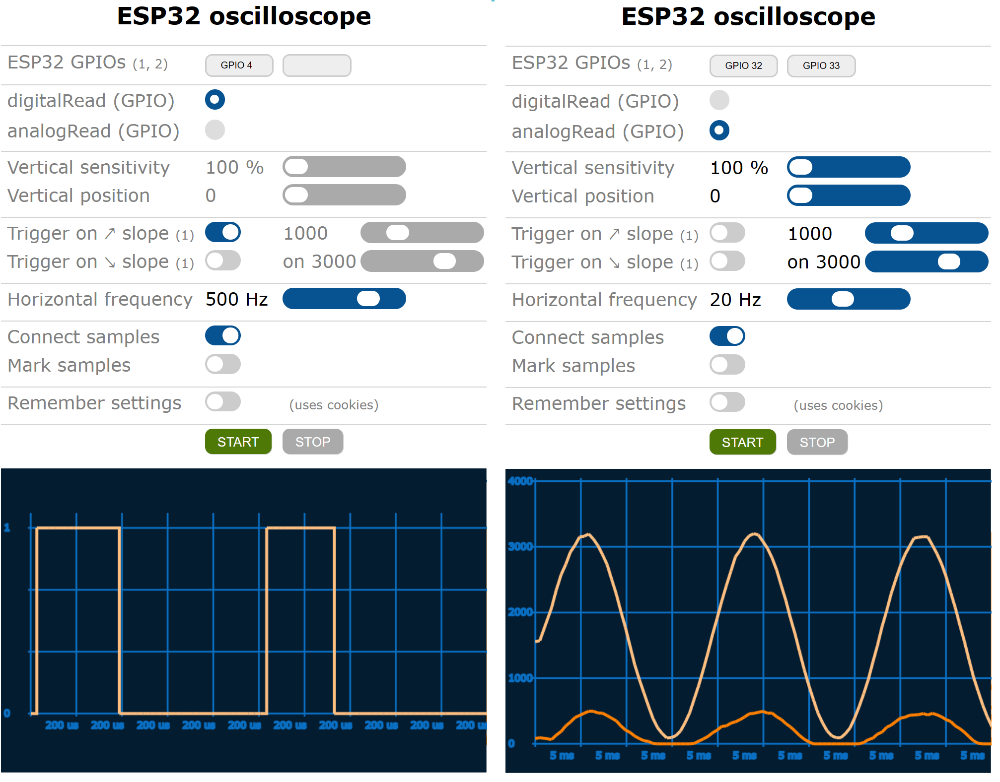

# ESP32 with Web Server, Telnet Server, file system and FTP Server

### 2021-FEB-28, xiaolaba testing done   
Hardware : NodeMCU EPS-32S, no PSRAM, 4MB FLASH, 80MHZ CPU  
~~Arduino IDE compiler setting : No OTA / 1M APP / 3M FATS, 1.5M FATS was not working as NTP failed~~   

1.5M FATS failed,
  

this is log when NTP failed.  
  
  
3M FATS working great,
  


### 2021-MAR-02, xiaolaba testing done
And we are able to manage this issue finally, perhaps Arduino IDE did not erase the chip completely before burn code and rendered something odd.

To uses a new chip and/or erase the chip on the own, it is able to uses 1.5MB FATFS finally, NTP is working too.  
Hardware : NodeMCU EPS-32S, 40MHZ XTAL, no PSRAM, 4MB FLASH  
Arduino IDE compiler setting : 1.5M FATS, 240MHZ CPU, do not follow 40MHZ XTAL of NodeMCU ESP-32S, it will be WDT triggered and constandly resetting.


here is the batch file used for investigation and workaround,


	:: To erase esp32 completely, do not rely on Arduino IDE and code upload, it has cluster and odd thing when uses FATFS.
	:: xiaolaba, 2020-MAR-02

	:: Arduino 1.8.13, esptool and path,
	set esptool=C:\Users\user0\AppData\Local\Arduino15\packages\esp32\tools\esptool_py\3.0.0/esptool.exe

	:: erase whole flash of esp32
	%esptool% --chip esp32 --port com5 --baud 921600 erase_flash

	pause


[Authour is very nice and helpful to fix the bug if telnet uses with putty](https://github.com/BojanJurca/Esp32_web_ftp_telnet_server_template/pull/8#issuecomment-788389107), telnet and dmesg is showing this workaround and result fro me,  


Index.html is revised, easy for cell phone & browser testing,  
  


ESP32 stream function is working conditionally with different browser  
Firefox is not working, Win10 Edge ok, Android chrome ok, any idea whether server side issue or the browser variance ?  
here is screen shot with win10 machine, on the left EDGE is ok, on the right firefox used was ver 86. 32 bit, error? 
  

---------------------------


It is more or less about user interface:

- **very fast and easy development of Telnet command-line user interface for your project** 
- **easy development of nice-looking Web user interface for your project**
- **working with files (uploading and downloading .html and other files)**
- **run-time monitoring of ESP32 behaviour with built-in dmesg Telnet command**
- **run-time monitoring of ESP32 signals with built-in Web-based oscilloscope**


In case of Web user interface all you need to do is to upload (with FTP) .html (.png, .jpg, …) files into your ESP32 /var/www/html directory and/or modify httpRequestHandler function that already exists in Esp32_web_ftp_telnet_server_template.ino according to your needs (see examples below).

In case of Telnet user interface all you need to do is to modify telnetCommandHandler function that already exists in Esp32_web_ftp_telnet_server_template.ino according to your needs (see example below).

You can go directly to Setup instructions and examples now or continue reading the rest of this text.

## Features

**webServer** can handle HTTP requests in two different ways. As a programmed response to some requests (typically small replies – see examples) or by sending .html files that have been previously uploaded into /var/www/html directory. Features:

   - HTTP protocol,
   - Cookies
   - WS protocol – only basic support for WebSockets is included so far,
   - webClient function is included for making simple HTTP requests from ESP32 to other servers,
   - threaded web server sessions,
   - time-out set to 1,5 seconds for HTTP protocol and 5 minutes for WS protocol to free up limited ESP32 resources used by inactive sessions,
   - support for HTTP 1.1 keep-alive directive,
   - optional firewall for incoming requests.

**telnetServer** can, similarly to webserver, handle commands in two different ways. As a programmed response to some commands or it can handle some already built-in commands by itself. Built-in commands implemented so far:

You can use the following commands:
   - quit
   - clear (or use cls instead of clear)
   - help
   - uname
   - uptime
   - reboot
   - reset
   - date or date -s YYYY/MM/DD hh:mm:ss (in 24-hour format)
   - ntpdate or ntpdate -u or ntpdate -u ntpServer
   - crontab or crontab -l
   - free or free -s n (where 0 < n < 300)
   - dmesg or dmesg --follow or dmesg -T or both
   - mkfs.fat
   - fs_info
   - ls or ls directoryName (or use dir instead of ls)
   - tree or tree directoryName
   - mkdir directoryName
   - rmdir directoryName
   - cd directoryName or cd ..
   - pwd
   - cat fileName or cat > fileName (or use type instead of ls)
   - vi fileName
   - cp existingFileName newFileName (or use copy instead of cp)
   - mv existingFileName newFileName or mv existingDirectoryName newDirectoryName
   - rm fileName
   - passwd or passwd userName
  useradd -u userId -d userHomeDirectory userName (where userId > 1000)
   - userdel userName
   - ifconfig (or use ipconfig instead of ifconfig)
   - iw
   - arp
   - ping targetIP
   - telnet tergetIP
   - curl http://url or curl method http://url (where method is GET, PUT, ...)

Other features:

   - threaded Telnet sessions,
   - time-out set to 5 minutes to free up limited ESP32 resources used by inactive sessions,  
   - optional firewall for incoming connections.

**ftpServer** is needed for uploading configuration files, .html files, etc. onto ESP32 file system. Unlike webServer and telnetServer it does not expose a programming interface. Built-in commands that are implemented so far:

   - pwd
   - cd
   - ls
   - rmdir
   - mkdir
   - rm
   - put osFileName esp32FileName
   - get esp32FileName osFileName

Other features:

   - active and passive data connections (you can use command line FTP client or Windows Explorer for example) 
   - threaded FTP sessions,
   - time-out set to 5 minutes to free up limited ESP32 the resources used by inactive sessions,  
   - optional firewall for incoming connections.

**TcpServer** is the heart of all three servers mentioned above but it can also be used as stand-alone (see example). 

Features:

   - threaded TCP server,
   - non-threaded TCP server,
   - non-threaded TCP client,
   - optional time-out to free up limited ESP32 resources used by inactive sessions,  
   - optional firewall for incoming connections.

**File system** is needed for storing configuration files, .html files used by web server, etc. FAT flash file system is used. Make sure you compile your sketch for one of FAT partition schemas (Tool | Partition Scheme).

**Configuration files** Esp32_web_ftp_telnet_server_template uses Unix / Linux / Raspbian like network configuration files:

   - /etc/passwd contains users' accounts information
   - /etc/shadow contains users' passwords
   - /network/interfaces contains STA(tion) configuration
   - /etc/wpa_supplicant/wpa_supplicant.conf contains STA(tion) credentials
   - /etc/dhcpcd.conf contains A(ccess) P(oint) configuration
   - /etc/hostapd/hostapd.conf contains A(ccess) P(oint) credentials
   - /etc/ntp.conf contains NTP time servers' names
   - /etc/crontab contains cheduled tasks  

These files are created at first run of your sketch with default settings (you can modify default settings in source code before you run the sketch for the first time). 

**User accounts**. Three types of managing user login are supported (depending on how USER_MANAGEMENT is #define-d):

   - UNIX, LINUX, Raspbian like (using user management files - this is the default setting) - use #define USER_MANAGEMENT   UNIX_LIKE_USER_MANAGEMENT,
   - hardcoded (username is root, password is hardcoded in to Arduino sketch constants) - use #define USER_MANAGEMENT   HARDCODED_USER_MANAGEMENT,
   - no user management at all (everyone can Telnet or FTP to ESP32 servers without password) - use #define USER_MANAGEMENT   NO_USER_MANAGEMENT.

Only "root" user with "rootpassword" password, "webadmin" user with "webadminpassword" password, "webserver" (with no password, this is system account intended only to hold webserver home directory) and "telnetserver" (with no password, this is system account intended only to hold telnetserver home directory) users are created at initialization. You can create additional users if you need them or change their passwords at initialization (by modifying the part of code in user_management.h) or upload your own files onto ESP32 with FTP. User management implemented in Esp32_web_ftp_telnet_server_template is very basic, only 3 fields are used: user name, hashed password and home directory. The following files are used to store user management information:

   - /etc/passwd contains users' accounts information
   - /etc/shadow contains users' passwords

**Time functions**. Time_functions.h provides GMT to local time conversion from 35 different time zones. #define TIMEZONE to one of the following (or add your own and modify timeToLocalTime function appropriately): 

KAL_TIMEZONE, MSK_TIMEZONE, SAM_TIMEZONE, YEK_TIMEZONE, OMS_TIMEZONE, KRA_TIMEZONE, IRK_TIMEZONE, YAK_TIMEZONE, VLA_TIMEZONE, SRE_TIMEZONE, PET_TIMEZONE, JAPAN_TIMEZONE, CHINA_TIMEZONE, WET_TIMEZONE, ICELAND_TIMEZONE, CET_TIMEZONE, EET_TIMEZONE, FET_TIMEZONE, NEWFOUNDLAND_TIMEZONE, ATLANTIC_TIME_ZONE, ATLANTIC_NO_DST_TIMEZONE, EASTERN_TIMEZONE, EASTERN_NO_DST_TIMEZONE, CENTRAL_TIMEZONE, CENTRAL_NO_DST_TIMEZONE, MOUNTAIN_TIMEZONE, MOUNTAIN_NO_DST_TIMEZONE, PACIFIC_TIMEZONE, ATLANTIC_NO_DST_TIMEZONE, EASTERN_TIMEZONE, CENTRAL_TIMEZONE, MOUNTAIN_TIMEZONE, PACIFIC_TIMEZONE, ALASKA_TIMEZNE, HAWAII_ALEUTIAN_TIMEZONE, HAWAII_ALEUTIAN_NO_DST_TIMEZONE, AMERICAN_SAMOA_TIMEZONE, BAKER_HOWLAND_ISLANDS_TIMEZONE, WAKE_ISLAND_TIMEZONE, CHAMORRO_TIMEZONE.

By default, TIMEZONE is #define-d as: #define TIMEZONE CET_TIMEZONE. Time_functions.h also takes care of synchronizing ESP32 clock with NTP servers once a day.

**cronDaemon** scans crontab table and executes tasks at specified time. You can schedule tasks from code or write them in to /etc/crontab file (see examples). 


## Setup instructions

1. Copy all files in this package into Esp32_web_ftp_telnet_server_template directory.
2. Open Esp32_web_ftp_telnet_server_template.ino with Arduino IDE.
3. modify the default #definitions that will be written into configuration files when sketch runs for the first time.
4. Select one of FAT partition schemas (Tool | Partition Scheme).
5. Compile sketch and run it on your ESP32.

Doing this the following will happen:

  - ESP32 flash memory will be formatted with FAT file system. WARNING: every information you have stored into ESP32’s flash memory will be lost.
  - network configuration files will be created with the following settings:
  - your ESP32 will be configured to use DHCP in STAtion mode (with DEFAULT_STA_SSID / DEFAULT_STA_PASSWORD #definitions),
  - your ESP32 AccessPoint SSID will be MyESP32Server (with DEFAULT_AP_PASSWORD #definition),
  - your ESP32 AccessPoint IP will be 10.0.1.3,
   - user management files will be created with the following user accounts:
      - root / rootpassword,
      - webadmin / webadminpassword,
      - webserver with no password since this is a system account used only to define webserver home directory,
      - telnetserver with no password since this is also a system account used only to define telnetserver home directory.

At this point, you can already test if everything is going on as planned by http, FTP or telnet to your ESP32. Your ESP32 is already working as a server but there are a few minor things yet left to be done.

6. FTP to your ESP32 as webadmin / webadminpassword and upload the following files into /var/www/html/ directory:

   - index.html,
   - android-192.png,
   - apple-180.png,
   - example02.html,
   - example03.html,
   - example04.html,
   - example05.html,
   - login.html
   - logout.html
   - example10.html,
   - oscilloscope.html.

```
C:\esp32_web_ftp_telnet_server_template>ftp yourEsp32IP
Connected to 10.0.0.22.
220-MyESP32Server FTP server - please login
200 UTF8 enabled
User (10.0.0.22:(none)): webadmin
331 enter password: webadminpassword
230 logged on, your home directory is "/var/www/html/"
ftp> put index.html
226 transfer complete
ftp> put android-192.png
226 transfer complete
ftp> put apple-180.png
226 transfer complete
ftp> put example02.html
226 transfer complete
ftp> put example03.html
226 transfer complete
ftp> put example04.html
226 transfer complete
ftp> put example05.html
226 transfer complete
ftp> put login.html
226 transfer complete
ftp> put logout.html
226 transfer complete
ftp> put example10.html
226 transfer complete
ftp> put oscilloscope.html
226 transfer complete
ftp> ls /var/www/html/
200 port ok
150 starting transfer
-rw-rw-rw-   1 root     root             1818  Nov 14 21:33      android-192.png
-rw-rw-rw-   1 root     root             1596  Nov 14 21:33      apple-180.png
-rw-rw-rw-   1 root     root             6807  Nov 14 21:33      index.html
-rw-rw-rw-   1 root     root            39561  Nov 14 21:35      oscilloscope.html
-rw-rw-rw-   1 root     root             1147  Nov 14 21:33      example02.html
-rw-rw-rw-   1 root     root             1905  Nov 14 21:34      example03.html
-rw-rw-rw-   1 root     root             3521  Nov 14 21:34      example04.html
-rw-rw-rw-   1 root     root             9355  Nov 14 21:34      example05.html
-rw-rw-rw-   1 root     root             3177  Nov 14 21:34      
login.html
-rw-rw-rw-   1 root     root             4847  Nov 14 21:34      logout.html
-rw-rw-rw-   1 root     root             2633  Nov 14 21:34      
example10.html
226 transfer complete
```

Files will be placed into webadmin home directory, which is /var/www/html/.

7. FTP to your ESP32 as root / rootpassword and upload help.txt into /var/telnet/ directory, which is a home directory of telnetserver system account.

```
C:\esp32_web_ftp_telnet_server_template>ftp yourEsp32IP
Connected to 10.0.0.22.
220-MyESP32Server FTP server - please login
200 UTF8 enabled
User (10.0.0.22:(none)): root
331 enter password: rootpassword
230 logged on, your home directory is "/"
ftp> put help.txt /var/telnet/help.txt
226 transfer complete
```

8. Delete all the examples and functionalities that don't need and all the references to them in the code. They are included just to make the development easier for you.

## How to continue from here?

Esp32_web_ftp_telnet_server_template is what its name says, just a working template. A programmer is highly encouraged to add or change each piece of code as he or she sees appropriate for his or her projects. Esp32_web_ftp_telnet_server_template.ino is pretty comprehensive, small and easy to modify so it may be a good starting point.

## Building HTML user interface for your ESP32 project

A series of examples will demonstrate how to create a neat HTML user interface for your ESP32 project.

**Example 01 - dynamic HTML page**

You can always use static HTML that can be uploaded (with FTP) as .html files into /var/www/html directory but they would always display the same content. If you want to show what is going on in your ESP32 you can generate a dynamic HTML page for each HTTP request. The easiest way is modifying httpRequestHandler function that already exists in Esp32_web_ftp_telnet_server_template.ino according to your needs. For example:

```C++
String httpRequestHandler (String& httpRequest, httpServer::wwwSessionParameters *wsp) { // - must be reentrant!

  if (httpRequest.substring (0, 20) == "GET /example01.html ") 
    return String ("<HTML>Example 01 - dynamic HTML page<br><br><hr />") + (digitalRead (2) ? "Led is on." : "Led is off.") + String ("<hr /></HTML>");
                                                                   
  return ""; // httpRequestHandler did not handle the request - tell httpServer to handle it internally by returning "" reply
}
```

**Example 02 - static HTML page calling REST functions**

Once HTML pages get large enough dynamic generation becomes impractical. The preferred way is building a large static HTML page that will be accessed by web browser and would call smaller server-side functions. In this case, we have two sides where programming code is located at run time. The server-side code is still in ESP32 whereas client-side code is in your web browser. They communicate with each other in standardised way - through REST functions. Although REST functions could respond in HTML manner they usually use JSON format.

Let's take a look at server-side first. Change code in httpRequestHandler function that already exists in Esp32_web_ftp_telnet_server_template.ino:

```C++
String httpRequestHandler (String& httpRequest, httpServer::wwwSessionParameters *wsp) { // - must be reentrant!
  
  if (httpRequest.substring (0, 16) == "GET /builtInLed ") {
      return "{\"id\":\"esp32\",\"builtInLed\":\"" + (digitalRead (2) ? String ("on") : String ("off")) + "\"}\r\n";

  return ""; // httpRequestHandler did not handle the request - tell httpServer to handle it internally by returning "" reply
}
```

We do not have C++ compiler available in browser, but Javascript will do the job as well. See example02.html:

```HTML
<html>
  Example 02 - static HTML page calling REST functions<br><br>
  <hr />
  Led is <span id='ledState'>...</span>.
  <hr />
  <script type='text/javascript'>

    // mechanism that makes REST calls
    var httpClient = function () { 
      this.request = function (url, method, callback) {
        var httpRequest = new XMLHttpRequest ();
        httpRequest.onreadystatechange = function () {
          if (httpRequest.readyState == 4 && httpRequest.status == 200) callback (httpRequest.responseText);
        }
        httpRequest.open (method, url, true);
        httpRequest.send (null);
      }
    }

    // make a REST call and initialize/populate this page
    var client = new httpClient ();
    client.request ('/builtInLed', 'GET', function (json) {
                                                            // json reply looks like: {"id":"ESP32_SRV","builtInLed":"on"}
                                                            document.getElementById ('ledState').innerText = (JSON.parse (json).builtInLed);
                                                          });

  </script>
</html>
```

**Example 03 - HTML page interacting with ESP32**

We had only one-way server-client (ESP32-HTML) communication so far. It was used to initialize/populate HTML page. However, the communication can also be bi-directional – client (HTML page) telling the server (ESP32) what to do. We will use the same mechanism except for the use of PUT method instead of GET in REST calls (the latter is only the matter of understanding; GET method would do the job just as well).

Server will have to handle two additional cases:

```C++
String httpRequestHandler (String& httpRequest, httpServer::wwwSessionParameters *wsp) { // - must be reentrant!

  if (httpRequest.substring (0, 16) == "GET /builtInLed ") {
getBuiltInLed:
      return "{\"id\":\"esp32\",\"builtInLed\":\"" + (digitalRead (2) ? String ("on") : String ("off")) + "\"}\r\n";
  } else if (httpRequest.substring (0, 19) == "PUT /builtInLed/on ") {
      digitalWrite (2, HIGH);
      goto getBuiltInLed;
  } else if (httpRequest.substring (0, 20) == "PUT /builtInLed/off ") {
      digitalWrite (2, LOW);
      goto getBuiltInLed;
  } 

  return  // httpRequestHandler did not handle the request - tell httpServer to handle it internally by returning "" reply
}
```

In HTML we use input tag of checkbox type. See example03.html:

```HTML
<html>
  Example 03 - HTML page interacting with ESP32<br><br>
  <hr />
  Led: <input type='checkbox' disabled id='ledSwitch' onClick='turnLed (this.checked)'>
  <hr />
  <script type='text/javascript'>

    // mechanism that makes REST calls
    var httpClient = function () { 
      this.request = function (url, method, callback) {
        var httpRequest = new XMLHttpRequest ();
        httpRequest.onreadystatechange = function () {
          if (httpRequest.readyState == 4 && httpRequest.status == 200) callback (httpRequest.responseText);
        }
        httpRequest.open (method, url, true);
        httpRequest.send (null);
      }
    }

    // make a REST call and initialize/populate this page
    var client = new httpClient ();
    client.request ('/builtInLed', 'GET', function (json) {
                                                            // json reply will look like: {"id":"ESP32_SRV","builtInLed":"on"}
                                                            var obj=document.getElementById ('ledSwitch'); 
                                                            obj.disabled = false; 
                                                            obj.checked = (JSON.parse (json).builtInLed == 'on');
                                                          });

  function turnLed (switchIsOn) { // send desired led state to ESP32 and refresh ledSwitch state
    client.request (switchIsOn ? '/builtInLed/on' : '/builtInLed/off' , 'PUT', function (json) {
                                                            var obj = document.getElementById ('ledSwitch'); 
                                                            obj.checked = (JSON.parse (json).builtInLed == 'on');                                                           
                                                          });
  }

  </script>
</html>
```

Everything works fine now but it looks awful.

**Example 04 - user interface with style**
   
Style user interface with CSS like in example04.html:

```HTML
<html>

  <style>
   /* nice page framework */
   hr {border: 0; border-top: 1px solid lightgray; border-bottom: 1px solid lightgray}
   h1 {font-family: verdana; font-size: 40px; text-align: center}
   div.d1 {position: relative; overflow: hidden; width: 100%; height: 40px}
   div.d2 {position: relative; float: left; width: 15%; font-family: verdana; font-size: 30px; color: gray;}
   div.d3 {position: relative; float: left; width: 85%; font-family: verdana; font-size: 30px; color: black;}

   /* nice switch control */
   .switch {position: relative; display: inline-block; width: 60px; height: 34px}
   .slider {position: absolute; cursor: pointer; top: 0; left: 0; right: 0; bottom: 0; background-color: #ccc; -webkit-transition: .4s; transition: .4s}
   .slider:before {position: absolute; content: ''; height: 26px; width: 26px; left: 4px; bottom: 4px; background-color: white; -webkit-transition: .4s; transition: .4s}
   input:checked+.slider {background-color: #2196F3}
   input:focus+.slider {box-shadow: 0 0 1px #2196F3}
   input:checked+.slider:before {-webkit-transform: translateX(26px); -ms-transform: translateX(26px); transform: translateX(26px)}
   .switch input {display: none}
   .slider.round {border-radius: 34px}
   .slider.round:before {border-radius: 50%}
   input:disabled+.slider {background-color: #aaa}
  </style>

  <body>

    <br><h1>Example 04 - user interface with style</h1>

    <hr />
    <div class='d1'>
     <div class='d2'>&nbsp;Led</div>
     <div class='d3'>
      <label class='switch'><input type='checkbox' id='ledSwitch' disabled onClick='turnLed(this.checked)'><div class='slider round'></div></label>
     </div>
    </div>
    <hr />

    <script type='text/javascript'>

      // mechanism that makes REST calls
      var httpClient = function () { 
        this.request = function (url, method, callback) {
          var httpRequest = new XMLHttpRequest ();
          httpRequest.onreadystatechange = function () {
            if (httpRequest.readyState == 4 && httpRequest.status == 200) callback (httpRequest.responseText);
          }
          httpRequest.open (method, url, true);
          httpRequest.send (null);
        }
      }

      // make a REST call and initialize/populate this page
      var client = new httpClient ();
      client.request ('/builtInLed', 'GET', function (json) {
                                                              // json reply will be in a form: {"id":"ESP32_SRV","builtInLed":"on"}
                                                              var obj = document.getElementById ('ledSwitch'); 
                                                              obj.disabled = false; 
                                                              obj.checked = (JSON.parse (json).builtInLed == 'on');
                                                            });

    function turnLed (switchIsOn) { // send desired led state to ESP and refresh ledSwitch state
      client.request (switchIsOn ? '/builtInLed/on' : '/builtInLed/off' , 'PUT', function (json) {
                                                              var obj = document.getElementById ('ledSwitch');  
                                                              obj.checked = (JSON.parse (json).builtInLed == 'on');                                                           
                                                            });
    }

    </script>
  </body>
</html>
```

More controls with style can be found in **example05.html**.

## Building Telnet user interface for your ESP32 project

**Example 06 - processing Telnet command line**

Compared to HTML user interface Telnet user interface is a piece of cake. Modify telnetCommandHandler function that already exists in Esp32_web_ftp_telnet_server_template.ino according to your needs. For example:

```C++
String telnetCommandHandler (int argc, String argv [], telnetServer::telnetSessionParameters *tsp) { // - must be reentrant!

  if (argc == 2 && argv [0] == "led" && argv [1] == "state") {
getBuiltInLed:
    return "Led is " + (digitalRead (2) ? String ("on.\n") : String ("off.\n"));
  } else if (argc == 3 && argv [0] == "turn" && argv [1] == "led" && argv [2] == "on") {
    digitalWrite (2, HIGH);
    goto getBuiltInLed;
  } else if (argc == 3 && argv [0] == "turn" && argv [1] == "led" && argv [2] == "off") {
    digitalWrite (2, LOW);
    goto getBuiltInLed;
  }

  return; // telnetCommand has not been handled by telnetCommandHandler - tell telnetServer to handle it internally by returning "" reply
}
```

## Other examples

**Example 07 - cookies**

Example 07 demonstrates the way web server handles cookies.

```C++
String httpRequestHandler (String& httpRequest, httpServer::wwwSessionParameters *wsp) { // - must be reentrant!
  
  if (httpRequest.substring (0, 20) == "GET /example07.html ") { // used by example 07
                                                                 String refreshCounter = wsp->getHttpRequestCookie ("refreshCounter");           // get cookie that browser sent in HTTP request
                                                                 if (refreshCounter == "") refreshCounter = "0";
                                                                 refreshCounter = String (refreshCounter.toInt () + 1);
                                                                 wsp->setHttpResponseCookie ("refreshCounter", refreshCounter, getGmt () + 60);  // set 1 minute valid cookie that will be send to browser in HTTP reply
                                                                 return String ("<HTML>Example 07<br><br>This page has been refreshed " + refreshCounter + " times. Click refresh to see more.</HTML>");
                                                               }

  return ""; // httpRequestHandler did not handle the request - tell httpServer to handle it internally by returning "" reply
}
```

**Example 08 - reading time**

Example 08 demonstrates the use of time_functions.h.

```C++
time_t t = getGmt ();
if (!t) {
  Serial.printf ("[example 08] current time has not been obtained from NTP server(s) yet\n");
} else {
  Serial.printf ("[example 08] current UNIX time is %li\n", t);

  char str [30];
  time_t l = timeToLocalTime (t); // alternativelly you can use l = getLocalTime ();
  strftime (str, 30, "%d.%m.%y %H:%M:%S", gmtime (&l));
  Serial.printf ("[example 08] current local time is %s\n", str); // alternativelly you can use timeToString (l)
} 
```

**Example 09 - making HTTP requests (REST calls for example) directly from ESP32**

Up to now, we have only made REST calls from within Javascript (from browser). However, for establishing machine-to-machine communication REST calls should be made directly from C++ code residing in ESP32. The only drawback is that C++ does not support parsing JSON answers natively. You have to program the parsing yourself (not included in this example).

Example 09 shows how we can use TcpServer objects to make HTTP requests.

```C++
void example09_makeRestCall () {
  String s = webClient ((char *) "127.0.0.1", 80, 5000, "GET /builtInLed"); // send request to local loopback port 80, wait max 5 s (time-out)
  if (s > "")
    Serial.print ("[example 09] " + s);
  else
    Serial.printf ("[example 09] the reply didn't arrive (in time) or it is corrupt or too long\n");

  return;
}
```

## WebSockets

**Example 10 - WebSockets**

A basic WebSocket support is built-in into webServer. Text and binary data can be exchanged between browser and ESP32 server in both ways. I only tested the example below on little endian machines. The code is supposed to work on big endian machines as well (I was not able to test it though).

Example 10 demonstrates how ESP32 server could handle WebSockets:

```C++
void wsRequestHandler (String& wsRequest, WebSocket *webSocket) { // - must be reentrant!

  if (wsRequest.substring (0, 26) == "GET /example10_WebSockets ") { // Example 10

    while (true) {
      switch (webSocket->available ()) {
        case WebSocket::NOT_AVAILABLE:  delay (1);
                                        break;
        case WebSocket::STRING:       { // text received
                                        String s = webSocket->readString ();
                                        Serial.printf ("[example 10] got text from browser over webSocket: %s\n", s.c_str ());
                                        break;
                                      }
        case WebSocket::BINARY:       { // binary data received
                                        char buffer [256];
                                        int bytesRead = webSocket->readBinary (buffer, sizeof (buffer));
                                        Serial.printf ("[example 10] got %i bytes of binary data from browser over webSocket\n", bytesRead);
                                        // note that we don't really know anything about format of binary data we have got, we'll just assume here it is array of 16 bit integers
                                        // (I know they are 16 bit integers because I have written javascript client example myself but this information can not be obtained from webSocket)
                                        int16_t *i = (int16_t *) buffer;
                                        while ((char *) (i + 1) <= buffer + bytesRead) Serial.printf (" %i", *i ++);
                                        Serial.printf ("\n[example 10] Looks like this is the Fibonacci sequence,\n"
                                                         "[example 10] which means that both, endianness and complements are compatible with javascript client.\n");
                                        
                                        // send text data
                                        if (!webSocket->sendString ("Thank you webSocket client, I'm sending back 8 32 bit binary floats.")) goto errorInCommunication;
  
                                        // send binary data
                                        float geometricSequence [8] = {1.0}; for (int i = 1; i < 8; i++) geometricSequence [i] = geometricSequence [i - 1] / 2;
                                        if (!webSocket->sendBinary ((byte *) geometricSequence, sizeof (geometricSequence))) goto errorInCommunication;
                                                         
                                        break; // this is where webSocket connection ends - in our simple "protocol" browser closes the connection but it could be the server as well ...
                                               // ... just "return;" in this case (instead of break;)
                                      }
        case WebSocket::ERROR:          
  errorInCommunication:     
                                        Serial.printf ("[example 10] error in communication, closing connection\n");
                                        return; // close this connection
      }
    }
}
```

On the browser side Javascript program could look something like example10.html:

```HTML
<html>
  <body>

    Example 10 - using WebSockets<br><br>

    <script type='text/javascript'>

      if ("WebSocket" in window) {
        var ws = new WebSocket ("ws://" + self.location.host + "/example10_WebSockets"); // open webSocket connection
				
        ws.onopen = function () {
          alert ("WebSocket connection established.");

          // ----- send text data -----

          ws.send ("Hello webSocket server, after this text I'm sending 32 16 bit binary integers."); 
          // alert ("Text sent over WebSocket.");

          // ----- send binary data -----

          const fibonacciSequence = new Uint16Array (32);
          fibonacciSequence [0] = -21;
          fibonacciSequence [1] = 13;
          for (var i = 2; i < 32; i ++) fibonacciSequence [i] = fibonacciSequence [i - 1] + fibonacciSequence [i - 2]; 
          ws.send (fibonacciSequence);
          // alert ("Binary data sent over WebSocket.");
        };

        ws.onmessage = function (evt) { 
          if (typeof(evt.data) === 'string' || evt.data instanceof String) { // UTF-8 formatted string data

            // ----- receive text data -----

            alert ("[example 10] got text from server over webSocket: " + evt.data);
	  }
          if (evt.data instanceof Blob) { // binary data

            // ----- receive binary data as blob and then convert it into array buffer -----

            var myFloat32Array = null;
            var myArrayBuffer = null;
            var myFileReader = new FileReader ();
            myFileReader.onload = function (event) {
              myArrayBuffer = event.target.result;
              myFloat32Array = new Float32Array (myArrayBuffer); // <= our data is now here, in the array of 32 bit floating point numbers

              var myMessage = "[example 10] got " + myArrayBuffer.byteLength + " bytes of binary data from server over webSocket\n[example 09]";
              for (var i = 0; i < myFloat32Array.length; i++) myMessage += " " + myFloat32Array [i];
                alert (myMessage);
                // note that we don't really know anything about format of binary data we have got, we'll just assume here it is array of 32 bit floating point numbers
                // (I know they are 32 bit floating point numbers because I have written server C++ example myself but this information can not be obtained from webSocket)

                alert ("[example 10] Looks like this is the geometric sequence,\n" + 
                       "[example 10] which means that 32 bit floating point format is compatible with ESP32 C++ server.\n");

                ws.close (); // this is where webSocket connection ends - in our simple "protocol" browser closes the connection but it could be the server as well

            };
            myFileReader.readAsArrayBuffer (evt.data);

          }
        };
				
        ws.onclose = function () { 
          alert ("WebSocket connection is closed."); 
        };

      } else {
        alert ("WebSockets are not supported by your browser.");
      }

    </script>
  </body>
</html>
```

## Writing your own server using TCP protocol

**Example 11 - Morse server**

In example 11 we’ll create a Morse echo server with the use of TcpServer instance. Whenever two computers communicate with each other, they have to follow a protocol of communication. Morse echo server protocol is very simple. The server will read everything the client sends, convert it into Morse code and send reply back to the client.
Morse echo server will only listen on port 24 for 30 seconds then it will shut down and free the resources.
While starting and stopping the server is quite straightforward, more attention must be put to routine that handles the connection. Make sure it is reentrant for it can run in many threads simultaneously.

```C++
// start new TCP server
TcpServer *myServer = new TcpServer (morseEchoServerConnectionHandler, // function that is going to handle the connections
                                     NULL,      // no additional parameter will be passed to morseEchoServerConnectionHandler function
                                     4096,      // 4 KB stack for morseEchoServerConnectionHandler is usually enough
                                     180000,    // time-out - close connection if it is inactive for more than 3 minutes
                                     "0.0.0.0", // serverIP, 0.0.0.0 means that the server will accept connections on all available IP addresses
                                     24,        // server port number, 
                                     NULL);     // don't use firewall in this example
// check success
if (myServer->started ()) {
  Serial.printf ("[example 11] Morse echo server started, try \"telnet <server IP> 24\" to try it\n");

  // let the server run for 30 seconds - this much time you have to connect to it to test how it works
  delay (30000);

  // shut down the server - is any connection is still active it will continue to run anyway
  delete (myServer);
  Serial.printf ("[example 11] Morse echo server stopped, already active connections will continue to run anyway\n");
} else {
  Serial.printf ("[example 11] unable to start Morse echo server\n");
}

void morseEchoServerConnectionHandler (TcpConnection *connection, void *parameterNotUsed) {  // connection handler callback function
  Serial.printf ("[%10lu] [example 11] new connection arrived from %s\n", millis (), connection->getOtherSideIP ());
  
  char inputBuffer [256] = {0}; // reserve some stack memory for incomming packets
  char outputBuffer [256] = {0}; // reserve some stack memory for output buffer 
  int bytesToSend;
  // construct Morse table. Make it static so it won't use the stack
  static const char *morse [43] = {"----- ", ".---- ", "..--- ", "...-- ", "....- ", // 0, 1, 2, 3, 4
                                   "..... ", "-.... ", "--... ", "---.. ", "----. ", // 5, 6, 7, 8, 9
                                   "   ", "", "", "", "", "", "",                    // space and some characters not in Morse table
                                   ".- ", "-... ", "-.-. ", "-.. ", ". ",            // A, B, C, D, E
                                   "..-. ", "--. ", ".... ", ".. ", ".--- ",         // F, G, H, I, J
                                   "-.- ", ".-.. ", "-- ", "-. ", "--- ",            // K, L, M, N, O
                                   ".--. ", "--.- ", ".-. ", "... ", "- ",           // P, Q, R, S, T
                                   "..- ", "...- ", ".-- ", "-..- ", "-.-- ",        // U, V, W, X, Y
                                   "--.. "};                                         // Z
  unsigned char c;
  int index;  
  
  // send welcome reply first as soon as new connection arrives - in a readable form
  sprintf (outputBuffer, "Type anything except Ctrl-C - this would end the connection.\xff\xfe\x01\r\n");  // IAC DONT ECHO
  // IAC DONT ECHO is not really necessary. It is a part of telnet protocol. Since we'll be using a telnet client
  // to test this example it is a good idea to communicate with it in the way it understands
  bytesToSend = strlen (outputBuffer);
  if (connection->sendData (outputBuffer, bytesToSend) != bytesToSend) {
    *outputBuffer = 0; // mark outputBuffer as empty
    Serial.printf ("[%10lu] [example 11] error while sending response\n", millis ());
    goto endThisConnection;
  }
  *outputBuffer = 0; // mark outputBuffer as empty
  
  // Read and process input stream in endless loop, detect "quit" substring. 
  // If "quit" substring is present then end this connection.
  // If 0 bytes arrive then the client has ended the connection or there are problems in communication.
  while (int received = connection->recvData (inputBuffer, sizeof (inputBuffer))) {
    for (int i = 0; i < received; i ++) {
      // calculate index of morse table entry
      c = inputBuffer [i];
      if (c == 3) goto endThisConnection; // Ctrl-C
      index = 11;                                     // no character in morse table
      if (c == ' ') index = 10;                       // space in morse table
      else if (c >= '0' && c <= 'Z') index = c - '0'; // letter in morse table
      else if (c >= 'a' && c <= 'z') index = c - 80;  // letter converted to upper case in morse table

      // fill outputBuffer if there is still some space left otherwise empty it
      if (strlen (outputBuffer) + 7 > sizeof (outputBuffer)) {
        bytesToSend = strlen (outputBuffer);
        if (connection->sendData (outputBuffer, bytesToSend) != bytesToSend) {
          *outputBuffer = 0; // mark outputBuffer as empty
          Serial.printf ("[%10lu] [example 11] error while sending response\n", millis ());
          goto endThisConnection;
        }
        strcpy (outputBuffer, morse [index]); // start filling outputBuffer with morse letter
      } else {
        strcat (outputBuffer, morse [index]); // append morse letter to outputBuffer
      }

    } // for loop
    bytesToSend = strlen (outputBuffer);
    if (connection->sendData (outputBuffer, bytesToSend) != bytesToSend) {
      *outputBuffer = 0; // mark outputBuffer as empty
      Serial.printf ("[%10lu] [example 11] error while sending response\n", millis ());
      goto endThisConnection;
    }    
    *outputBuffer = 0; // mark outputBuffer as empty
  } // while loop

endThisConnection: // first check if there is still some data in outputBuffer and then just let the function return 
  if (*outputBuffer) {
    bytesToSend = strlen (outputBuffer);
    if (connection->sendData (outputBuffer, bytesToSend) != bytesToSend) 
      Serial.printf ("[%10lu] [example 11] error while sending response\n", millis ());
  }
  Serial.printf ("[%10lu] [example 11] connection has just ended\n", millis ());
}
```

## Run-time monitoring ESP32 behaviour

**Example 12 - monitor your ESP32 behaviour with dmesg C++ function and dmesg Telnet command**

Telnet server provides Unix / Linux / Raspbian like dmesg circular message queue. You can monitor your ESP32 behaviour even when it is not connected to a computer with USB cable. How does it work? In your C++ code use dmesg (String); function to insert important message about the state of your code into dmesg circular queue. When you want to view it, connect to your ESP32 with telnet client and type dmesg command.


## Run-time monitoring ESP32 signals

**Oscilloscope - see the signals the way ESP32 sees them through Web interface**

ESP32 oscilloscope is web-based application included in Esp32_web_ftp_telnet_server_template. It is accessible through web browser once oscilloscope.html is uploaded to ESP32 (with FTP). ESP32 Oscilloscope is using WebSockets to exchange measured signal values between ESP32 and web browser.

The first picture below was generated by bouncing of an end switch. ESP32 Oscilloscope performed digitalRead-s after pin has been initialised in INPUT_PULLUP mode. The second picture shows noise coming from poorly regulated power supply. ESP32 Oscilloscope used analogRead-s on an unconnected pin.


